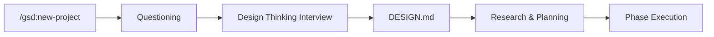

# Phase 7: Documentation & README - Research

**Researched:** 2026-03-05
**Domain:** Technical documentation / GitHub README authoring
**Confidence:** HIGH

## Summary

Phase 7 is documentation-only -- no code changes. The deliverable is a single `README.md` at the repo root that documents the full GSD with Design integration for users discovering the project. The README must cover installation (one-liner), what the fork adds, how design agents work, all commands, update safety, and uninstall. Mermaid diagrams provide visual explanations of key flows.

The upstream GSD README is comprehensive (~4500 words) with a conversational tone, shields.io badges, collapsible `<details>` sections, and GitHub callouts (`> [!NOTE]`, `> [!TIP]`). This fork's README should be technically direct (as decided by the user), shorter and more focused, and positioned as a community fork additive to vanilla GSD -- linking back to upstream for base GSD concepts rather than re-explaining them.

**Primary recommendation:** Write a single README.md with hero + one-liner install, Mermaid diagrams (main pipeline inline, others in `<details>`), commands table, and uninstall section. Keep it under 2000 words for scannability.

<user_constraints>
## User Constraints (from CONTEXT.md)

### Locked Decisions
- Hero + Quick Start first: 1-2 sentence description, quick install command, then detailed sections
- Structure for new users discovering this repo, but link to vanilla GSD for base concepts
- Commands reference table with brief descriptions AND usage examples for each new/modified command
- Brief uninstall section showing which files to remove to revert to vanilla GSD
- Mermaid diagrams (GitHub-rendered) for all 4 key flows:
  1. Design thinking pipeline (new-project -> interview -> DESIGN.md -> downstream)
  2. UI phase agent lifecycle (detection -> stack gate -> 3 parallel agents -> synthesis -> {phase}-UI.md)
  3. File architecture (commands/, workflows/design/, .planning/ artifacts)
  4. Update safety flow (how /gsd:update preserves design layer)
- Main pipeline diagram inline in hero/overview area for immediate visual impact
- Other diagrams in collapsible `<details>` sections to keep README scannable
- Lead with one-liner (`curl | sh` style) quick-start
- Expanded details below for manual install, PowerShell/Windows, and edge cases
- Technical and direct tone: "This adds X. Install with Y. It works by Z."
- Positioned as community fork, additive: "A fork that adds design thinking to GSD"
- Open to contributions: include a brief contributing section or link to CONTRIBUTING.md

### Claude's Discretion
- Badge selection (version, license, GSD compatibility) -- use if they add value, skip if cluttered
- License approach -- match upstream GSD or pick appropriate open-source license
- "How It Works" section depth -- pick appropriate detail level per section
- Exact Mermaid diagram syntax and level of detail
- Section ordering after hero + quick start

### Deferred Ideas (OUT OF SCOPE)
None -- discussion stayed within phase scope
</user_constraints>

<phase_requirements>
## Phase Requirements

| ID | Description | Research Support |
|----|-------------|-----------------|
| R7.1 | README documents full integration: new flow, agent lifecycles, {phase}-UI.md, commands, update behavior, install | All sections of the README map directly to this: hero, install, commands table, "How It Works" sections, Mermaid diagrams, update safety section |
| R7.2 | No new dependencies beyond what GSD already uses | This is a documentation-only phase -- no code, no deps. README should explicitly state the superset/no-new-deps guarantee |
</phase_requirements>

## Standard Stack

### Core
| Tool | Purpose | Why Standard |
|------|---------|--------------|
| Markdown | README format | GitHub standard, universal rendering |
| Mermaid | Flow diagrams | GitHub-native rendering, no external image hosting needed |
| `<details>` HTML | Collapsible sections | GitHub-supported, keeps README scannable |
| GitHub callouts | Warnings/tips | `> [!NOTE]`, `> [!TIP]`, `> [!IMPORTANT]` -- native GitHub rendering |

### Supporting
| Tool | Purpose | When to Use |
|------|---------|-------------|
| shields.io badges | Version/license indicators | Only if they add value (user's discretion area) |

No npm packages, build tools, or documentation generators. This is a single hand-authored Markdown file.

## Architecture Patterns

### README Structure (Recommended Section Order)
```
README.md
├── Hero (1-2 sentences + main Mermaid pipeline diagram)
├── Quick Start (one-liner install)
├── What It Adds (superset explanation)
├── How It Works
│   ├── Design Thinking (inline overview)
│   ├── UI Phase Agents (collapsible Mermaid)
│   ├── File Architecture (collapsible Mermaid)
│   └── Update Safety (collapsible Mermaid)
├── Commands Reference (table with examples)
├── Installation Details
│   ├── macOS / Linux (curl | sh)
│   ├── Windows / PowerShell
│   └── Manual install
├── Uninstall
├── Contributing
└── License
```

### Pattern 1: Mermaid Diagrams on GitHub
**What:** GitHub renders ` ```mermaid ` code blocks natively since 2022
**When to use:** All 4 flow diagrams specified in CONTEXT.md
**Constraints:**
- Use `graph TD` (top-down) or `graph LR` (left-right) for readability
- Keep node labels short (under 30 chars)
- Avoid complex styling that breaks GitHub's renderer
- Test diagrams by previewing on GitHub (or GitHub.dev)

**Example -- Design Thinking Pipeline:**


**Example -- Collapsible Diagram Pattern:**
```markdown
<details>
<summary>UI Phase Agent Lifecycle</summary>

` ` `mermaid
graph TD
    A["discuss-phase"] --> B{"UI Detected?"}
    B -->|Yes| C["Stack Gate"]
    B -->|No| D["Vanilla GSD"]
    C --> E["3 Parallel Agents"]
    E --> F["{phase}-UI.md"]
` ` `

</details>
```

### Pattern 2: Commands Table with Examples
**What:** Reference table for all new/modified commands
**Structure:**
```markdown
| Command | Description | Example |
|---------|-------------|---------|
| `/gsd:design-thinking` | Run design interview | `/gsd:design-thinking` |
| `/gsd:design-ui` | View UI/UX/motion standards | `/gsd:design-ui` |
```

### Pattern 3: One-Liner Install
**What:** Minimal-friction first impression
**Format:**
```bash
curl -fsSL https://raw.githubusercontent.com/{owner}/{repo}/main/install.sh | sh
```
The install.sh already handles prerequisite checks (GSD installed, Node.js available), so the README should just present the command and mention what the installer verifies.

### Anti-Patterns to Avoid
- **Wall of text:** Use `<details>` for secondary content; keep the top-level flow scannable
- **Re-explaining GSD:** Link to upstream repo. Don't duplicate GSD docs
- **Over-documenting internals:** Users need to know commands and flows, not implementation details of keyword detection algorithms
- **Missing uninstall:** Builds trust, especially for an overlay installer that modifies existing files

## Don't Hand-Roll

| Problem | Don't Build | Use Instead | Why |
|---------|-------------|-------------|-----|
| Diagrams | ASCII art or external images | Mermaid code blocks | GitHub-native, maintainable, version-controllable |
| Badges | Custom HTML | shields.io URLs | Standard, auto-updating, consistent style |
| Collapsible content | JS toggles | `<details>/<summary>` HTML | GitHub-native, no scripts needed |
| Callouts | Bold text hacks | `> [!NOTE]` syntax | GitHub-native, consistent rendering |

## Common Pitfalls

### Pitfall 1: Mermaid Syntax Errors Breaking Rendering
**What goes wrong:** Mermaid block shows as raw text instead of diagram
**Why it happens:** Special characters in labels, missing quotes around multi-word labels, unsupported Mermaid features on GitHub
**How to avoid:** Always quote node labels with brackets `["label"]`, avoid semicolons in labels, stick to `graph` and `flowchart` diagram types (most reliable on GitHub), test by pushing to a branch first
**Warning signs:** Labels with parentheses, colons, or hyphens without quotes

### Pitfall 2: `<details>` Without Blank Lines
**What goes wrong:** Markdown inside `<details>` renders as raw text
**Why it happens:** GitHub's Markdown parser requires a blank line after `<summary>` and before closing `</details>` for Markdown content to be parsed
**How to avoid:** Always include blank lines:
```markdown
<details>
<summary>Title</summary>

[blank line required here for Markdown to render]

Content goes here

</details>
```

### Pitfall 3: Curl Pipe Insecurity Perception
**What goes wrong:** Users hesitate at `curl | sh` without understanding what happens
**How to avoid:** Briefly mention what the installer does (verifies GSD, copies files, patches commands) and link to the install.sh source. Offer manual alternative.

### Pitfall 4: Stale Documentation After Code Changes
**What goes wrong:** README references commands/files that changed in earlier phases
**How to avoid:** Cross-reference actual file contents during writing. The plan should verify all mentioned files exist and command names match their YAML frontmatter `name:` fields.

### Pitfall 5: Windows Install Instructions Incomplete
**What goes wrong:** Windows users can't run PowerShell script due to execution policy
**How to avoid:** Show the execution policy bypass command explicitly:
```powershell
powershell -ExecutionPolicy Bypass -File install.ps1
```

## Code Examples

### GitHub Callout Syntax
```markdown
> [!NOTE]
> GSD with Design is a superset of vanilla GSD. If you skip design thinking,
> all commands behave identically to upstream GSD.

> [!TIP]
> Run `/gsd:design-ui` during implementation for a quick reference of
> UI/UX/motion standards from your DESIGN.md.
```

### Badge Examples (shields.io)
```markdown


```

### Uninstall Section Pattern
```markdown
## Uninstall

To revert to vanilla GSD, remove the design layer files:

**Commands** (in `~/.claude/commands/gsd/`):
- `design-thinking.md`, `design-ui.md`, `design-stack.md`

**Workflows** (in `~/.claude/get-shit-done/workflows/design/`):
- Entire `design/` directory

**Patched commands** -- re-run `/gsd:update` to restore vanilla versions:
- `new-project.md`, `discuss-phase.md`, `plan-phase.md`, `update.md`

**Version tracking:**
- `~/.claude/get-shit-done/design-version.json`
```

## Inventory of Files to Document

All files that exist in the repo and must be accurately referenced in the README:

### Commands (`.claude/commands/gsd/`)
| File | Command Name | Type | Description |
|------|-------------|------|-------------|
| `design-thinking.md` | `/gsd:design-thinking` | New | Design interview producing DESIGN.md |
| `design-ui.md` | `/gsd:design-ui` | New | Quick reference for UI/UX/motion standards (read-only) |
| `design-stack.md` | `/gsd:design-stack` | New | Quick reference for stack conventions (read-only) |
| `new-project.md` | `/gsd:new-project` | Patched | Adds design thinking step after questioning |
| `discuss-phase.md` | `/gsd:discuss-phase` | Patched | Adds UI detection gate and agent spawning |
| `plan-phase.md` | `/gsd:plan-phase` | Patched | Loads DESIGN.md and {phase}-UI.md as context |
| `update.md` | `/gsd:update` | Patched | Preserves design layer during GSD updates |

### Workflows (`workflows/design/`)
| File | Purpose |
|------|---------|
| `stack-conventions.md` | Discovers stack, maps design dimensions to framework |
| `ui-design.md` | 8pt grid, 60-30-10 color, typography, component states |
| `ux-design.md` | Hick's Law, Peak-end, decision architecture, honest design |
| `motion-design.md` | Purposeful animation, reduced-motion first |
| `ui-detection.md` | Keyword-based detection of UI phases |
| `orchestrate-design.md` | Orchestrates parallel agent spawning and synthesis |

### Installation & Meta
| File | Purpose |
|------|---------|
| `install.sh` | POSIX sh overlay installer (macOS/Linux) |
| `install.ps1` | PowerShell overlay installer (Windows) |
| `design-version.json` | Version tracking with file checksums |

## Content Strategy

### What to Explain (Fork-Specific)
- What DESIGN.md is and what it contains (4 sections)
- How UI phases are auto-detected
- What the 3 design agents do and produce
- What `{phase}-UI.md` is
- How `/gsd:update` preserves the design layer
- What the superset guarantee means in practice

### What to Link to Upstream GSD For
- What GSD is and how it works
- Base commands (plan-phase, discuss-phase, etc.)
- Installation of base GSD (prerequisite)
- GSD concepts (phases, waves, Task tool, etc.)

### Tone Reference
User decided: "Technical and direct: 'This adds X. Install with Y. It works by Z.'" -- this is more concise and engineering-focused than upstream GSD's conversational founder-voice tone.

## License Recommendation (Claude's Discretion)

Upstream GSD uses MIT license. Recommendation: **Use MIT license** to match upstream and maintain fork compatibility. Create a LICENSE file alongside the README, or include a License section referencing MIT.

**Confidence:** MEDIUM -- need to verify upstream license at time of implementation.

## Badge Recommendation (Claude's Discretion)

Keep badges minimal -- 2-3 maximum:
1. Version badge (from design-version.json: v1.0.0)
2. License badge (MIT)
3. GSD compatibility badge (signals superset nature)

Skip: downloads, CI, social badges (not applicable for a new fork).

## Open Questions

1. **Repository URL for curl install command**
   - What we know: Install script exists and works locally
   - What's unclear: The exact GitHub owner/repo URL for the raw curl command
   - Recommendation: Use a placeholder `{owner}/{repo}` pattern -- the user will fill this in when they publish

2. **Contributing guidelines scope**
   - What we know: User wants a brief contributing section or link to CONTRIBUTING.md
   - What's unclear: Whether to create CONTRIBUTING.md or just inline a brief paragraph
   - Recommendation: Inline a 2-3 sentence paragraph in the README (lighter weight, sufficient for v1.0)

## Validation Architecture

### Test Framework
| Property | Value |
|----------|-------|
| Framework | Manual review (documentation phase) |
| Config file | none |
| Quick run command | `test -f README.md && echo "exists"` |
| Full suite command | Manual: verify all Mermaid diagrams render on GitHub, all links resolve, all file references are accurate |

### Phase Requirements to Test Map
| Req ID | Behavior | Test Type | Automated Command | File Exists? |
|--------|----------|-----------|-------------------|-------------|
| R7.1 | README covers all integration topics | manual-only | Visual inspection of rendered README | N/A |
| R7.2 | No new dependencies | smoke | `git diff --name-only HEAD~1 \| grep -v README \| grep -v LICENSE \| wc -l` should be 0 (or only doc files) | N/A |

### Sampling Rate
- **Per task commit:** Verify README.md file exists and is valid Markdown
- **Per wave merge:** Render check on GitHub preview
- **Phase gate:** Full review of rendered README against R7.1 checklist

### Wave 0 Gaps
None -- no test infrastructure needed for a documentation-only phase.

## Sources

### Primary (HIGH confidence)
- Project files: All command files, workflow files, install scripts, design-version.json read directly from repo
- CONTEXT.md: User decisions for README structure and tone
- PROJECT.md: Requirements R7.1, R7.2 definitions
- STATE.md: Project history and all decisions from phases 1-6

### Secondary (MEDIUM confidence)
- Upstream GSD README (fetched from GitHub raw): Structure and tone reference
- GitHub Mermaid rendering: Known supported since Feb 2022, widely documented

### Tertiary (LOW confidence)
- Upstream GSD license (stated as MIT in their README, not independently verified from LICENSE file)

## Metadata

**Confidence breakdown:**
- Standard stack: HIGH -- Markdown + Mermaid are GitHub-native, well-documented
- Architecture: HIGH -- README structure is straightforward, user decisions are clear
- Pitfalls: HIGH -- Mermaid gotchas and `<details>` blank-line issues are well-known
- Content accuracy: HIGH -- All file names and command names verified from actual repo files

**Research date:** 2026-03-05
**Valid until:** 2026-04-05 (documentation -- stable domain, long validity)
