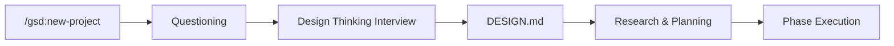
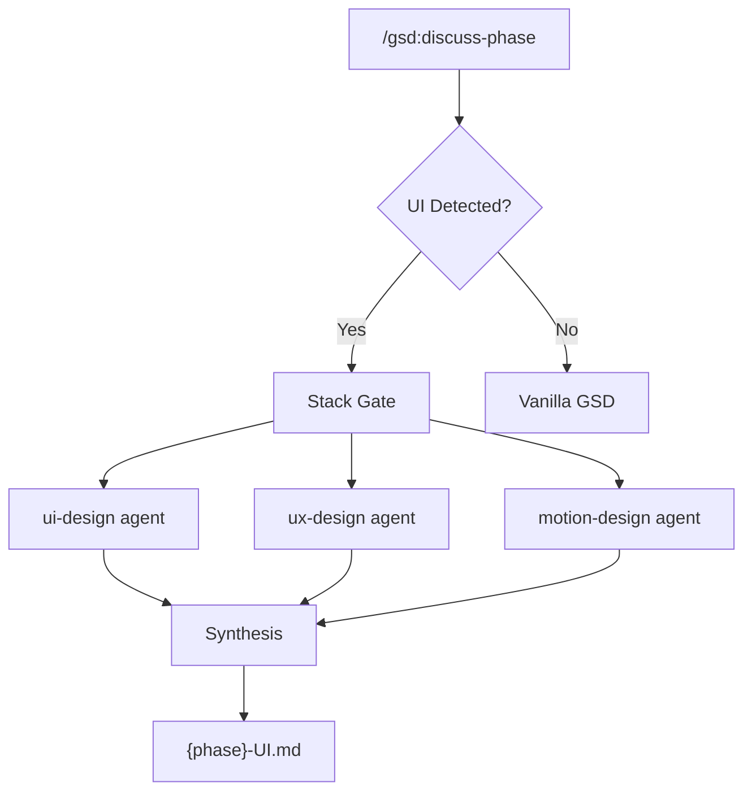
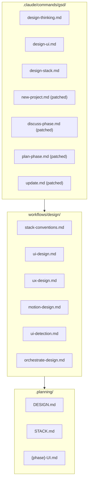
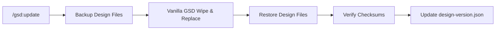

# GSD with Design

A fork of [get-shit-done](https://github.com/codefriendsclub/get-shit-done-cc) that adds design thinking to every project. Install it on top of vanilla GSD -- it adds design interviews, UI/UX/motion agents, and stack-aware conventions without changing existing behavior.



## Quick Start

```bash
curl -fsSL https://raw.githubusercontent.com/{owner}/{repo}/main/install.sh | sh
```

The installer verifies GSD is installed, copies design files, and patches commands. [View install.sh source](install.sh).

## What It Adds

GSD with Design is a strict superset of vanilla GSD. It adds a design thinking interview (producing `DESIGN.md`) and three design agents that run during UI-heavy phases. If you skip design thinking or your phase has no UI work, everything behaves identically to upstream GSD.

> [!NOTE]
> No existing GSD behavior is changed. If `DESIGN.md` does not exist, all commands fall through to their vanilla GSD implementations.

The central artifact is `.planning/DESIGN.md`, which captures four sections: Problem Space, Emotional Core, Solution Space, and Brand Identity. Downstream agents and planning commands consume this file automatically. For base GSD concepts (phases, waves, plans), see the [upstream GSD documentation](https://github.com/codefriendsclub/get-shit-done-cc).

## How It Works

### Design Thinking

`/gsd:design-thinking` runs a conversational interview that produces `.planning/DESIGN.md`. It covers four areas: Problem Space (who and why), Emotional Core (how it should feel), Solution Space (constraints and priorities), and Brand Identity (voice, palette, personality). This interview runs automatically during `/gsd:new-project` after the initial questioning phase -- or you can run it standalone at any time.

### UI Phase Agents

<details>
<summary>UI Phase Agent Lifecycle</summary>



When `/gsd:discuss-phase` runs, it checks whether the phase involves UI work using keyword-based detection (2+ keyword threshold with negative keyword suppression). You can override detection with `<!-- ui-phase -->` to force it on or `<!-- no-ui -->` to skip it.

If UI is detected, the stack-conventions agent runs first to map your framework to design dimensions (spacing, color, typography, motion). Then three agents run in parallel: ui-design (8pt grid, 60-30-10 color, typography, component states), ux-design (Hick's Law, decision architecture, honest design patterns), and motion-design (purposeful animation, reduced-motion-first). Their output is synthesized into `{phase}-UI.md` alongside the phase context.

Non-UI phases skip this entirely and proceed through vanilla GSD.

</details>

### File Architecture

<details>
<summary>File Layout</summary>



- **Commands** are slash commands invoked directly by users (`/gsd:command-name`).
- **Workflows** are agent definitions spawned by the orchestrator during phase discussion -- not invoked directly.
- **Artifacts** are generated files consumed by downstream planning and execution.

</details>

### Update Safety

<details>
<summary>How Updates Preserve the Design Layer</summary>



When you run `/gsd:update`, the patched update command backs up all design-layer files before GSD's clean wipe-and-replace cycle runs. After vanilla GSD finishes updating, design files are restored and checksums are verified against `design-version.json`. The update command itself is self-restoring -- it copies itself to backup before the wipe and restores afterward.

</details>

## Commands

| Command | Description | Example |
|---------|-------------|---------|
| `/gsd:design-thinking` | Run design thinking interview to create DESIGN.md | `/gsd:design-thinking` |
| `/gsd:design-ui` | View UI/UX/motion craft standards (read-only) | `/gsd:design-ui` |
| `/gsd:design-stack` | View stack conventions and framework recipes (read-only) | `/gsd:design-stack` |
| `/gsd:new-project` (modified) | Adds design thinking step after questioning | `/gsd:new-project` |
| `/gsd:discuss-phase` (modified) | Adds UI detection and agent spawning | `/gsd:discuss-phase 3` |
| `/gsd:plan-phase` (modified) | Loads DESIGN.md and {phase}-UI.md as context | `/gsd:plan-phase 3` |
| `/gsd:update` (modified) | Preserves design layer during GSD updates | `/gsd:update` |

> [!TIP]
> Run `/gsd:design-ui` during implementation for a quick-reference card of UI/UX/motion standards derived from your DESIGN.md.

## Installation

### macOS / Linux

```bash
curl -fsSL https://raw.githubusercontent.com/{owner}/{repo}/main/install.sh | sh
```

The installer is POSIX sh compatible (works with macOS's bash 3.2). It detects your GSD installation location, checks for existing design files, and offers to back up customizations before overwriting.

### Windows / PowerShell

Download `install.ps1` from this repository, then run:

```powershell
powershell -ExecutionPolicy Bypass -File install.ps1
```

### Manual Install

1. Clone this repository.
2. Copy `.claude/commands/gsd/design-thinking.md`, `design-ui.md`, and `design-stack.md` to your GSD commands directory.
3. Copy the `workflows/design/` directory to your GSD workflows directory.
4. Run the install script to patch existing commands (`new-project.md`, `discuss-phase.md`, `plan-phase.md`, `update.md`) with design-layer injection points, or manually copy the patched command shims from this repo.

## Uninstall

To revert to vanilla GSD, remove the design layer files:

**New commands** (in your GSD `commands/gsd/` directory):
- `design-thinking.md`
- `design-ui.md`
- `design-stack.md`

**Workflows** (in your GSD `workflows/` directory):
- Entire `design/` directory

**Version tracking** (in your GSD `get-shit-done/` directory):
- `design-version.json`

**Patched commands** -- run `/gsd:update` to restore vanilla versions of `new-project.md`, `discuss-phase.md`, `plan-phase.md`, and `update.md`.

## Contributing

Contributions are welcome. This project uses GSD for its own development -- check `.planning/` for the full roadmap and phase structure. Open a PR or issue on GitHub.

## License

[MIT](LICENSE)
